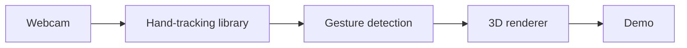
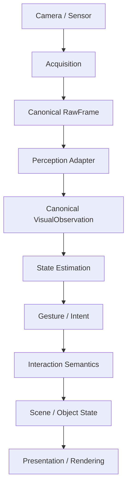
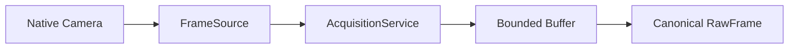

# Tony Stark-Inspired Spatial Interaction System

> A modular research platform for real-time, hand-tracked spatial interaction — for engineers and researchers who want performance claims backed by measurements, not demo reels.

  

*Not affiliated with Marvel or Disney — "Tony Stark" is used here only as shorthand for a familiar interface style. Everything below is real, in-progress engineering, independently measured on real hardware.*

## Table of Contents

- [Where This Stands](#where-this-stands)
- [Why This Exists](#why-this-exists)
- [Why This Approach](#why-this-approach)
- [Quick Start](#quick-start)
- [What Phase 1 Is Building Toward](#what-phase-1-is-building-toward)
- [Architecture](#architecture)
- [Performance Engineering](#performance-engineering)
- [Coordinate Systems and Transforms](#coordinate-systems-and-transforms)
- [Assets](#assets)
- [Observability](#observability)
- [Testing](#testing)
- [Requirements](#requirements)
- [Repository Structure](#repository-structure)
- [Documentation and Engineering Records](#documentation-and-engineering-records)
- [Development Philosophy](#development-philosophy)
- [Roadmap](#roadmap)
- [Current Limitations](#current-limitations)
- [Contributing](#contributing)
- [License](#license)
- [Next Step](#next-step)

## Where This Stands

**Phase 1 (acquisition foundation) is in progress. No Phase 1 completion or MacBook Air M5 performance claim is made yet.**

What's real today: versioned typed system contracts, deterministic geometry/interaction/scene semantics, a working native macOS (AVFoundation) camera path *and* a deterministic synthetic path, bounded acquisition buffering with drop/stale accounting, runtime instrumentation, and 31 deterministic tests — all passing.

What isn't real yet: the native camera path hasn't been validated on the actual target M5 hardware, there's no hand perception, gesture recognition, or live interaction runtime, and no perception backend has been selected. See [Roadmap](#roadmap) for the exact task-by-task state.

| Phase | Focus | Status |
|---|---|---|
| 1 — Visual Interaction | Webcam acquisition → hand perception → gesture-driven 3D manipulation | In progress (acquisition stage) |
| 2 — Sensorized Wearable Input | Complementary wearable sensing, fused with vision | Not started |
| 3 — Intelligent Interaction | Multimodal, context-aware intent interpretation | Not started |

## Why This Exists

Webcam hand-tracking demos are easy to make impressive and easy to make dishonest. A gesture-controlled 3D viewer built in a weekend can look exactly as convincing on camera as one with a genuinely low-latency, characterized real-time pipeline underneath — until someone tries to build on top of it and discovers the responsiveness was never actually measured.

This project exists to find out, with real measurements instead of a demo reel, how far a webcam-only pipeline can be pushed on real consumer hardware: what the true observation-to-action latency is, where it comes from, how it behaves under sustained use, and what breaks first.

## Why This Approach

The obvious shortcut looks like this:



That produces something that looks good in a GIF. It doesn't produce a system whose latency, jitter, tracking loss, and recovery behavior anyone has actually measured.

This project treats the perception backend as a **replaceable subsystem**, to be chosen later based on evidence:

| Dimension | What gets measured |
|---|---|
| Speed | Latency, throughput |
| Stability | Positional/rotational/scale jitter, landmark and state stability |
| Continuity | Temporal continuity, tracking loss and recovery |
| Robustness | Behavior under difficult visual conditions |
| Cost | CPU/GPU/resource usage, sustained (not just burst) behavior |
| Integration | Integration complexity |

The perception technology choice stays **intentionally undecided** until those measurements exist — see [`TDR-002-perception-selection.md`](./TDR-002-perception-selection.md).

## Quick Start

There's no interactive demo yet — Phase 1 hand perception isn't implemented. What you *can* run today is the deterministic test suite, which exercises the real contracts, geometry, interaction, scene, and acquisition logic without needing a camera.

```bash
git clone <repository-url>
cd Tony-Stark-Spatial-Interaction-System
pip install -e .
pytest
```

Expected result:

```text
31 passed
```

## What Phase 1 Is Building Toward

None of this is live yet, but it's what the architecture is already built to support:

- **Interaction** — selection, translation, rotation, and scaling, single-hand and two-hand
- **Content** — arbitrary supported 3D assets (`.glb`, `.gltf`, `.obj`), not one demo object
- **Replaceability** — swap the perception backend, renderer, or camera source without rewriting interaction or scene logic
- **Honesty by construction** — unsupported transforms and unavailable measurements fail explicitly instead of returning a plausible-looking wrong answer

## Architecture



The one rule that matters: **perception-specific details never leak downstream.** A future perception backend can use any CV framework or model it wants — everything past the Perception Adapter only ever sees canonical contracts. In practice: interaction logic doesn't know about the renderer, scene state doesn't know about the camera implementation, asset loading doesn't define interaction semantics, and instrumentation observes the system without becoming hidden correctness state.

### Typed Contracts

| Layer | Contracts |
|---|---|
| Acquisition / Perception | `RawFrame`, `VisualObservation` |
| State / Intent | `HandLandmarks`, `HandState`, `GestureHypothesis` |
| Interaction / Scene / Render | `InteractionEvent`, `SceneObjectState`, `PresentationState` |
| Observability | `MetricSample`, `TraceSpan` |

Every contract carries source identity, timestamps, coordinate space, units, validity, confidence, freshness, continuity, traceability, and schema/version — with **validity and confidence tracked as separate concepts** on purpose.

## Performance Engineering

FPS alone is never treated as a proxy for responsiveness. The performance model separately tracks capture, acquisition, perception, state-estimation, gesture/intent, interaction/scene-update, rendering, and presentation time; observation-to-action latency; queue age, frame drops, and jitter; CPU/GPU/memory usage; and sustained and thermal behavior where measurable.

### Acquisition Pipeline



Two acquisition sources exist today: a **synthetic** source for deterministic, replay-style tests, and a **native macOS** source — a Swift/AVFoundation helper that owns camera discovery, permissions, capture-session setup, frame delivery, and native timestamp/metadata extraction. Native AVFoundation objects never cross the acquisition boundary; the Python layer only handles canonicalization, sequencing, bounded buffering, drop/stale accounting, and instrumentation.

### Timing Model

Source capture time and application receipt time are tracked as separate, explicit fields — source timestamp, timestamp domain and origin, application timing, sequence numbers, and trace identifiers all survive the full pipeline. No latency calculation is allowed to silently subtract incompatible clock domains; where a platform can't provide trustworthy cross-clock correlation, the measurement is recorded as **unavailable**, never invented.

### Buffering Strategy

The acquisition path uses bounded buffering with explicit drop accounting — current and maximum queue depth, dropped/stale frames, sequence gaps, duplicates, reordered frames, and queue age are all tracked. Latest-observation-wins behavior is used where it helps interactive responsiveness, and unbounded queues are intentionally avoided.

## Coordinate Systems and Transforms

Spatial data uses explicit coordinate spaces: image, camera, hand/local, application/world, and object/local. Transforms are deterministic operations, not logic embedded inside gesture or rendering code, and quaternion-based rotation/composition is already supported.

One deliberate limitation: the current TRS representation rejects combinations it can't correctly express — specifically, arbitrary non-uniform scaling combined with rotation, which needs a general affine/matrix representation instead. It fails explicitly rather than silently returning a mathematically invalid transform.

## Assets

Phase 1 targets generalized 3D content, not one demo object — the supported boundary currently covers `.glb`, `.gltf`, and `.obj`. Asset validation is a boundary check today, not a full model-processing pipeline, which keeps asset-specific concerns out of interaction semantics.

## Observability

Every stage — source/frame, observation, state, gesture/event, scene revision, presentation frame — is tied together through traceable identifiers. Instrumentation covers monotonic timing, stage spans, queue measurements, frame/drop tracking, metric samples, statistical summaries, and benchmark metadata.

The goal is to be able to answer *"where did the latency come from,"* not just *"why does it feel kinda slow."*

## Testing

```text
tests/
├── test_contracts.py
├── test_geometry.py
├── test_interaction.py
├── test_scene.py
├── test_assets.py
├── test_display.py
├── test_observability.py
├── test_perception.py
├── test_acquisition.py
└── test_protocol.py
```

**31 deterministic tests pass today**, covering contract invariants, coordinate transforms, quaternion behavior, interaction state transitions, scene state, asset validation, display boundaries, traceability, bounded buffering, sequence/drop semantics, acquisition protocol validation, and perception adapter contracts. Hardware-dependent tests are kept separate from this deterministic suite, and validation on the target M5 hasn't happened yet.

## Requirements

- **Language/runtime:** Python (see `pyproject.toml` for the exact version pin) and Swift for the native camera helper.
- **Full native path (camera + AVFoundation):** macOS only. The target hardware is a MacBook Air, Apple Silicon M5, 10-core CPU/GPU, 24 GB unified memory — not yet validated even on that machine from the current Windows development environment.
- **Tests and synthetic acquisition:** platform-independent — no camera or macOS required.

Building and running the native Swift helper is covered in [`ACQUISITION.md`](./ACQUISITION.md) rather than duplicated here.

## Repository Structure

```text
Tony-Stark-Spatial-Interaction-System/
├── native/
│   └── CameraCapture.swift
├── src/
│   └── spatial_system/
│       ├── acquisition.py
│       ├── assets.py
│       ├── contracts.py
│       ├── display.py
│       ├── geometry.py
│       ├── instrumentation.py
│       ├── interaction.py
│       ├── perception.py
│       └── scene.py
├── tests/
│   ├── test_acquisition.py
│   ├── test_assets.py
│   ├── test_contracts.py
│   ├── test_display.py
│   ├── test_geometry.py
│   ├── test_interaction.py
│   ├── test_observability.py
│   ├── test_perception.py
│   ├── test_protocol.py
│   └── test_scene.py
├── tools/
│   └── acquisition_smoke.py
├── docs/
├── experiments/
├── PERFORMANCE_CONTRACT.md
├── PHASE1_AUDIT.md
├── PHASE1_EXIT_EVIDENCE.md
├── PHASE1_IMPLEMENTATION_GATES.md
├── PERCEPTION_EVALUATION.md
├── ACQUISITION.md
├── TDR-001-python-stdlib-foundation.md
├── TDR-002-perception-selection.md
├── TDR-003-camera-backend.md
├── pyproject.toml
└── README.md
```

## Documentation and Engineering Records

| Document | Covers |
|---|---|
| `PHASE1_AUDIT.md` | Audit of the current Phase 1 implementation state |
| `PERFORMANCE_CONTRACT.md` | The performance measurement contract and exit criteria |
| `PHASE1_EXIT_EVIDENCE.md` | Evidence required to declare Phase 1 complete |
| `PHASE1_IMPLEMENTATION_GATES.md` | Gating criteria for Phase 1 milestones |
| `PERCEPTION_EVALUATION.md` | Evaluation criteria and results for perception-backend selection |
| `ACQUISITION.md` | Acquisition subsystem design, including native build details |
| `TDR-001-python-stdlib-foundation.md` | Decision record: Python stdlib foundation |
| `TDR-002-perception-selection.md` | Decision record: perception technology selection |
| `TDR-003-camera-backend.md` | Decision record: camera backend choice |

Technical Decision Records cover material architectural decisions and stay marked provisional wherever empirical validation is still pending.

## Development Philosophy

- **Measure before optimizing** — performance work follows measured bottlenecks, not intuition.
- **Separate correctness from perception quality** — a tracking model can be confident and still produce data unsuitable for interaction.
- **Keep boundaries replaceable** — camera backend, perception technology, renderer, and future sensors should all be swappable.
- **Prefer explicit failure over silent corruption** — unsupported operations and unavailable measurements are represented explicitly.
- **Treat sustained performance as real performance** — a short burst of high FPS isn't evidence of a stable interactive system.
- **Reproducibility matters** — hardware experiments record enough metadata to make results comparable across runs.

## Roadmap

### Phase 1 — Visual Interaction

- [x] Architecture and contracts
- [x] Deterministic interaction semantics
- [x] Geometry and transforms
- [x] Scene/content abstraction
- [x] Instrumentation foundation
- [x] Bounded acquisition
- [x] Synthetic acquisition
- [x] Native macOS AVFoundation implementation
- [x] Acquisition protocol hardening
- [x] Deterministic acquisition tests
- [ ] Validate native backend on MacBook Air M5
- [ ] Enumerate and characterize camera modes
- [ ] Establish reproducible M5 acquisition baseline
- [ ] Measure sustained acquisition behavior
- [ ] Select perception technology empirically
- [ ] Implement live hand perception
- [ ] Implement state estimation
- [ ] Implement live interaction
- [ ] Complete Phase 1 exit evidence

### Phase 2 — Sensorized Wearable Input

- [ ] Define wearable sensor architecture
- [ ] Implement wearable firmware
- [ ] Implement telemetry transport
- [ ] Validate independent sensor streams
- [ ] Implement temporal alignment
- [ ] Implement sensor fusion
- [ ] Benchmark fused interaction

### Phase 3 — Intelligent Interaction

- [ ] Intelligent intent interpretation
- [ ] Temporal gesture understanding
- [ ] Multimodal interaction
- [ ] Context-aware interaction
- [ ] Final system validation

## Current Limitations

These are documented limitations, not hidden assumptions:

- Native macOS execution hasn't been validated from the Windows development environment yet.
- Target M5 camera measurements don't exist yet.
- Camera capability characterization is incomplete.
- Native interruption/recovery behavior isn't fully validated.
- The perception backend hasn't been selected.
- Live hand perception isn't implemented.
- Phase 1 performance completion hasn't been established.
- Some general affine transform cases need a future matrix representation.
- Asset validation is a boundary validator today, not a complete asset decoder.

## Contributing

This is an early-stage, single-maintainer research project, and the core contracts and phase gates are still moving underneath it. If you want to contribute:

1. Set it up the same way as [Quick Start](#quick-start).
2. Run `pytest` before opening a PR — it's the only enforced check right now.
3. Open an issue or discussion first, especially for anything touching contracts, coordinate semantics, or the phase-gate structure, so changes don't collide with work already in flight.

Formal lint/format tooling and a PR template aren't set up yet. [Roadmap](#roadmap) and [Current Limitations](#current-limitations) are the most honest source of "what's actually open" right now.

## License

No license is specified yet. Until one is added, standard copyright applies by default and the code isn't licensed for reuse. [choosealicense.com](https://choosealicense.com) is a reasonable starting point before this repository goes public.

## Next Step

Read [`PHASE1_AUDIT.md`](./PHASE1_AUDIT.md) and [`PERCEPTION_EVALUATION.md`](./PERCEPTION_EVALUATION.md) for the most current, most honest picture of where this stands — or open an issue if you're working on a similar low-latency perception problem and want to compare notes.
